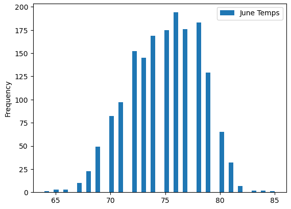
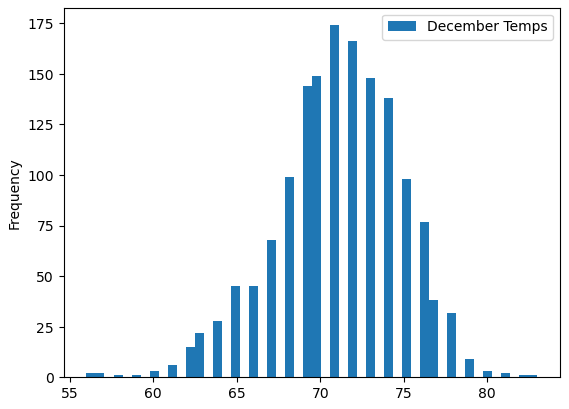

# SURF'S UP

## Overview

The obejective of this analysis is to determine whether its a good idea to open an Ice cream/Surfboard rental shop in Hawaii. Narrowing it down, we are discussing Oahu in specific. To determine this, I analyzed the weather during one month in the summer and one month in the winter. The data extraction was done using SQLAlchemy.

## Results
### June

First, I extracted the data from the month of June from the weather station data. In total, there were 1700 points of data from all of the stations in the month of June. Once the data was created into a Data Frame the following information was found:

* The lowest temperature in June was 64 degrees. 
* The highest temperature was 85 degrees. 
* The average temperature was 75 degrees.
* The standard deviation in June was approx 3.26 degrees. 

We can see the data visually below. 

### December

Once the June data was discovered, it was relatively easy to convert the code to produce December information. There were a total of 1517 counts of data for the month of December. 

* The lowest temperature in December was 56 degrees.
* The highest temperature in December 83 degrees.
* The average temperature was 71 degrees.
* The standard deviation in December was approx 3.75 degrees.

We can see the histogram below.

## Summary

The data shows us that both months have very similar temperatures. It is Hawaii after all! Getting into the details, it is warmer in June with an average temperature of 75. There were a number of times that the temp got below 60 in December. In June, it rarely fell below 65. The idea of building an Ice cream/Surfboard shack seems like a great idea because although it's slightly cooler in December, the weather is always comfortable in Hawaii. People will rent our surfboards, and then once they are all hot and tired from all the surfing, we can cool them down with the sweet, delicious, cold ice cream.

### Additional
While completing the analysis, I felt that creating a histogram graph was a good choice to complete the look of the analysis. I created a plot for both June and December. If we wanted to dive even deeper, we could also create queries to get the precipitation data for those months as well. 

